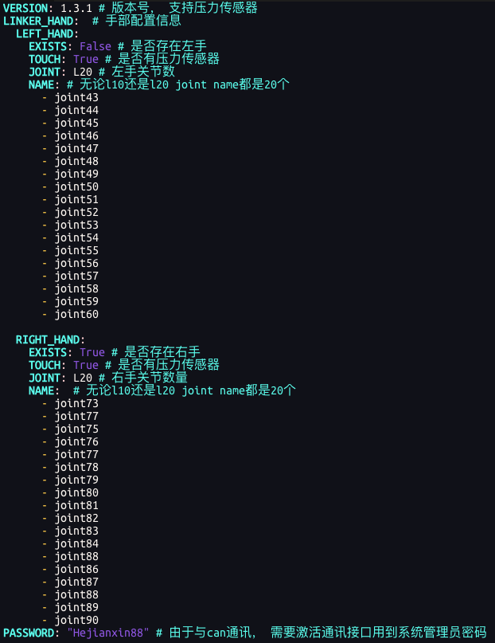
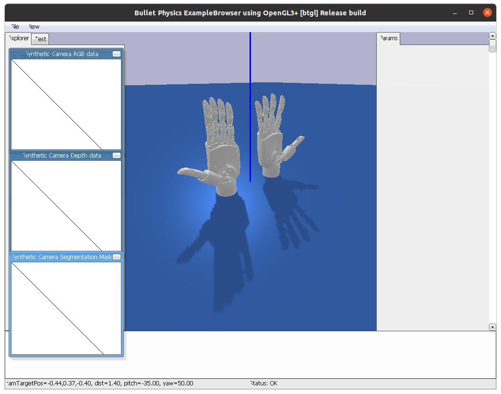
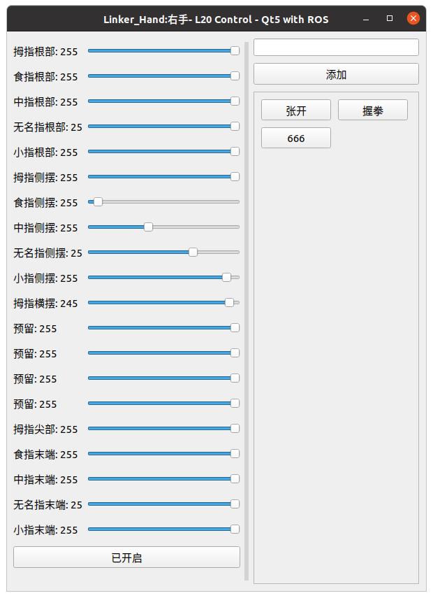

# LinkerHandROS SDK程序案例
<!-- TOC --> 
[examples (示例)](#)
## L10/L20
- [0000-linker_hand_pybullet (PyBullet仿真示例)](linker_hand_pybullet/)
- [0001-get_linker_hand_state (获取LinkerHand灵巧手当前状态)](L20_get_linker_hand_state/)
- [0002-gui_control(图形界面控制)](gui_control/)
- [0003-get_linker_hand_force (获取LinkerHand灵巧手力传感器数据)](get_linker_hand_force/)
- [0004-get_linker_hand_speed (获取LinkerHand灵巧手当前速度)](get_linker_hand_speed/)
- [0005-get_linker_hand_current (获取LinkerHand灵巧手当前电流)](get_linker_hand_current/)
- [0006-set_linker_hand_speed (设置LinkerHand灵巧手速度)](set_linker_hand_speed/)
- [0007-set_linker_hand_current (设置LinkerHand灵巧手当前电流)](set_linker_hand_current/)
- [0008-set_linker_hand_torque (设置LinkerHand灵巧手扭矩)](set_linker_hand_torque/)
- [0009-finger_guessing (互动示例，猜拳游戏)](finger_guessing/) 注:需要有RGB摄像头
---
## Python L20
- [0101-lipcontroller (触觉传感器配合灵巧手进行捏取操作)](L20/gesture-show/lipcontroller.py)
- [0102-gesture-Show-OK (使用python控制手比OK动作)](L20/gesture-show/gesture-Show-OK.py)
- [0103-gesture-Show-Surround-Index-Finger (使用python控制手做旋转食指动作)](L20/gesture-show/gesture-Show-Surround-Index-Finger.py)
- [0104-gesture-Show-Wave (使用python控制手做波浪运动)](L20/gesture-show/gesture-Show-Wave.py)
- [0105-gesture-Show-Ye (使用python控制手做一套复杂的展示动作)](L20/gesture-show/gesture-Show-Ye.py)
- [0106-gesture-Loop (使用python控制手循环抓握动作)](L20/gesture-show/gesture-Loop.py)
## Python L25
- [0107-action_group_l25 (使用python控制L25手指舞)](L25/gesture/action_group_l25.py)
## Python L7
- [0108-action-group-show-ti (使用python控制L7手指舞)](L7/gesture/action-group-show-ti.py)
---
## L25
- [0000-linker_hand_pybullet (PyBullet仿真示例)](linker_hand_pybullet/)
- [0201-set_disability (设置L25灵巧手为失能模式)](L25/set_disability.py) ```$ python set_disability.py --hand_type=left or right ```
- [0202-set_enable (设置L25灵巧手为使能模式)](L25/set_enable.py) ```$ python set_enable.py --hand_type=left or right ```
- [0203-set_remote_control (设置L25灵巧手为遥操模式)](L25/set_remote_control.py) ```$ python set_remote_control.py --hand_type=left or right ```
---
## 模仿学习
- [1001-human-dex (使用LinkerHand灵巧手进行模仿学习训练并且实现自主抓取物品)](https://github.com/linkerbotai/human-dex)
- [1002-linker_unidexgrasp (基于LinkerHand的Unidexgrasp灵巧手抓取算法)](https://github.com/linkerbotai/linker_unidexgrasp)


## LinkerHand灵巧手配置文件说明
LinkerHand灵巧手无论是真机还是仿真，均需要先配置参数文件。根据实际需求修改相应配置参数。

(1) 修改配置文件,针对LinkerHand灵巧手实物或仿真环境进行配置:
```bash
$ cd Linker_Hand_SDK_ROS/src/linker_hand_sdk/linker_hand_sdk_ros/config
$ sudo vim setting.yaml
```
 


由于图形界面只能单独控制一只LinkerHand灵巧手。需要在配置文件中进行相应配置需与LinkerHand灵巧手实物匹配


## LinkerHand灵巧手示例100
LinkerHand灵巧是示例100，提供了丰富的实例案例与源码。充分展示了LinkerHand灵巧手的功能
- 准备
启动SDK
```bash
# 新开终端 启动ros
$ roscore
```
新开终端启动ROS SDK
```bash
$ cd Linker_Hand_SDK_ROS/
$ source ./devel/setup.bash
$ roslaunch linker_hand_sdk_ros linker_hand.launch
```
- #### 0000-PyBullet仿真示例
新开终端 SDK可控制仿真器内的LinkerHand灵巧手
```bash
$ cd Linker_Hand_SDK_ROS/
$ source ./devel/setup.bash
# hand:=L20/L25
$ rosrun linker_hand_pybullet linker_hand_pybullet.py _hand:=L10
```



## Mujoco仿真环境
修改linker_hand_mujoco/launch/linker_hand_mujoco.launch文件内相关参数
- [9001-linker_hand_mujoco](linker_hand_mujoco/) # 支持topic or GUI控制仿真Linker Hand L7、L10、L20、L21
```bash
    <!-- 参数定义 -->
    <arg name="hand_type" default="left"/>  # left or right
    <arg name="hand_joint" default="L20"/>  # L7、L10、L20、L21
```
启动mujoco仿真
```bash
$ cd linker_hand_sdk
$ pip install -r requirements.txt
$ source ./devel/setup.bash
$ roslaunch linker_hand_mujoco linker_hand_mujoco.launch
```
mujoco仿真启动成功后可启动GUI控制界面控制仿真灵巧手
修改gui_control/launch/gui_control_left.launch or gui_control_right.launch
```bash
    <!-- 左手节点 -->
    <node pkg="gui_control" type="gui_control_left.py" name="gui_control$(anon left)" output="screen">
        <param name="hand_joint" type="string" value="L20"/> <!-- L7|L10|L20|L21|L25 灵巧手型号  -->
    </node>
```
启动GUI
```bash
$ cd linker_hand_sdk
$ source ./devel/setup.bash
$ roslaunch gui_control gui_control_left.launch # or roslaunch gui_control gui_control_right.launch
```

## 仿真joint


- #### 0001-获取LinkerHand灵巧手当前状态，状态数值包括范围值与弧度值
新开终端
```bash
$ cd Linker_Hand_SDK_ROS/
$ source ./devel/setup.bash
# _loop参数为True则终端循环打印当前LinkerHand灵巧手的状态数值，如果为False则终端只打印一次当前LinkerHand灵巧手状态数值
$ rosrun L20_get_linker_hand_state L20_get_linker_hand_state.py _loop:=True
```


- #### 0002-图形界面控制
图形界面控制可以通过滑动块控制LinkerHand灵巧手L10、L20各个关节独立运动。也可以通过添加按钮记录当前所有滑动块的数值，保存LinkerHand灵巧手当前各个关节运动状态。通过功能性按钮进行动作复现。    

使用gui_control控制LinkerHand灵巧手:
gui_control界面控制灵巧手需要启动linker_hand_sdk_ros，以topic的形式对LinkerHand灵巧手进行操作
```bash
# 新开终端 启动ros
$ roscore
```
新开终端启动ROS SDK
```bash
$ cd Linker_Hand_SDK_ROS/
$ source ./devel/setup.bash
$ roslaunch linker_hand_sdk_ros linker_hand.launch
```
 

启动成功后会有sdk版本、CAN接口状态、灵巧手配置信息和当前灵巧手关节速度等提示信息。
新开终端启动gui控制
```bash
$ cd Linker_Hand_SDK_ROS/
$ source ./devel/setup.bash
$ rosrun gui_control gui_control.py
```
开启后会弹出UI界面。通过滑动条可控制相应LinkerHand灵巧手关节运动。并可通过右侧添加按钮对当前滑动条数据进行保存，以便用于复现使用

 

- #### 0003-获取LinkerHand灵巧手力传感器数据 注：支持V2.1.4以后版本不在支持，在Topic中获取
开启SDK后，新开终端
```bash
$ cd Linker_Hand_SDK_ROS/
$ source ./devel/setup.bash
# _loop参数为True则终端循环打印当前LinkerHand灵巧手的状态数值，如果为False则终端只打印一次当前LinkerHand灵巧手状态数值
$ rosrun get_linker_hand_force get_linker_hand_force.py _loop:=False
#2025-01-15 15:43:16  左手没有数据
#2025-01-15 15:43:16  右手五指法相力: [0.0, 0.0, 0.0, 0.0, 0.0]
#2025-01-15 15:43:16  右手五指切向力: [0.0, 0.0, 0.0, 0.0, 0.0]
#2025-01-15 15:43:16  右手五指切向力方向: [255.0, 255.0, 255.0, 255.0, 255.0]
#2025-01-15 15:43:16  右手五指接近感应: [0.0, 0.0, 0.0, 0.0, 0.0]
```

- #### 0004-获取LinkerHand灵巧手力当前速度
开启SDK后，新开终端
```bash
$ cd Linker_Hand_SDK_ROS/
$ source ./devel/setup.bash
# _loop参数为True则终端循环打印当前LinkerHand灵巧手的状态数值，如果为False则终端只打印一次当前LinkerHand灵巧手状态数值
$ rosrun get_linker_hand_speed get_linker_hand_speed.py _loop:=False
#2025-01-15 15:57:17  左手没有数据
#2025-01-15 15:57:17  当前右手五指速度为: [180, 250, 250, 250, 250]
```


- #### 0005-获取LinkerHand灵巧手力当前电流
开启SDK后，新开终端
```bash
$ cd Linker_Hand_SDK_ROS/
$ source ./devel/setup.bash
# _loop参数为True则终端循环打印当前LinkerHand灵巧手的状态数值，如果为False则终端只打印一次当前LinkerHand灵巧手状态数值
$ rosrun get_linker_hand_current get_linker_hand_current.py _loop:=False
#2025-01-15 16:25:29  左手没有数据
#2025-01-15 16:25:29  当前右手五指电流为: [42, 42, 42, 42, 42]
```

- #### 0009-互动示例，猜拳游戏 注:需要有RGB摄像头
开启SDK后，新开终端
```bash
$ cd Linker_Hand_SDK_ROS/
$ source ./devel/setup.bash
$ rosrun finger_guessing finger_guessing.py
```
---

- #### 0101-触觉传感器配合灵巧手进行捏取操作
使用本例需要启动linker_hand_sdk_ros
```bash
# 新开终端 启动ros
$ roscore
```
新开终端启动ROS SDK
```bash
$ cd Linker_Hand_SDK_ROS/
$ source ./devel/setup.bash
$ roslaunch linker_hand_sdk_ros linker_hand.launch
```
 

启动成功后会有sdk版本、CAN接口状态、灵巧手配置信息和当前灵巧手关节速度等提示信息。
新开终端来使用演示例子
```bash
python ./<你的文件路径>/lipcontroller.py
```

- 如终端打印出“__开始演示__”即为正常运行，此时手设置如果正确，应开始使用食指和中指进行捏的动作，捏到物品会停止，拿走物品后会继续尝试捏，直到捏到物品或运动到极限，极限状态如下图


-  __lipcontroller.py__ 是基于7版手进行开发的演示demo，应用在其他版本的演示时，需要调整拇指和食指的对合姿态，否则无法实现“__食指和拇指捏合在一起__”的动作

- #### 0102-使用python控制手比OK动作
使用本例需要启动linker_hand_sdk_ros
```bash
# 新开终端 启动ros
$ roscore
```
新开终端启动ROS SDK
```bash
$ cd Linker_Hand_SDK_ROS/
$ source ./devel/setup.bash
$ roslaunch linker_hand_sdk_ros linker_hand.launch
```
 

启动成功后会有sdk版本、CAN接口状态、灵巧手配置信息和当前灵巧手关节速度等提示信息。
新开终端来使用演示例子
```bash
python ./<你的文件路径>/gesture-Show-OK.py
#开始后终端会打印测试中，此时手会开始做OK的手势，并弯曲中指无名指小指和伸直动作
```


- #### 0103-使用python控制手做旋转食指动作
使用本例需要启动linker_hand_sdk_ros
```bash
# 新开终端 启动ros
$ roscore
```
新开终端启动ROS SDK
```bash
$ cd Linker_Hand_SDK_ROS/
$ source ./devel/setup.bash
$ roslaunch linker_hand_sdk_ros linker_hand.launch
```
 

启动成功后会有sdk版本、CAN接口状态、灵巧手配置信息和当前灵巧手关节速度等提示信息。
新开终端来使用演示例子
```bash
python ./<你的文件路径>/gesture-Show-Surround-Index-Finger.py
#开始后终端会打印测试中，此时手会开始握拳并伸出食指，食指会不断重复旋转
```

- #### 0104-使用python控制手做波浪运动
使用本例需要启动linker_hand_sdk_ros
```bash
# 新开终端 启动ros
$ roscore
```
新开终端启动ROS SDK
```bash
$ cd Linker_Hand_SDK_ROS/
$ source ./devel/setup.bash
$ roslaunch linker_hand_sdk_ros linker_hand.launch
```
 

启动成功后会有sdk版本、CAN接口状态、灵巧手配置信息和当前灵巧手关节速度等提示信息。
新开终端来使用演示例子
```bash
python ./<你的文件路径>/gesture-Show-Wave.py
#开始后终端会打印测试中，此时手拇指向外舒展不动，其余四指开始做波浪运动
```

- #### 0105-使用python控制手做一套复杂的展示动作
使用本例需要启动linker_hand_sdk_ros
```bash
# 新开终端 启动ros
$ roscore
```
新开终端启动ROS SDK
```bash
$ cd Linker_Hand_SDK_ROS/
$ source ./devel/setup.bash
$ roslaunch linker_hand_sdk_ros linker_hand.launch
```
 

启动成功后会有sdk版本、CAN接口状态、灵巧手配置信息和当前灵巧手关节速度等提示信息。
新开终端来使用演示例子
```bash
python ./<你的文件路径>/gesture-Show-Ye.py
#开始后终端会打印测试中，此时手会开始做一套复杂的动作来展示手的灵活性
```
-本例是基于7版手进行开发的演示demo，应用在其他版本的演示时，需要调整拇指和食指的对合姿态，否则无法实现“__食指和拇指捏合或对合在一起__”的动作

- #### 0106-使用python控制手循环抓握动作
使用本例需要启动linker_hand_sdk_ros
```bash
# 新开终端 启动ros
$ roscore
```
新开终端启动ROS SDK
```bash
$ cd Linker_Hand_SDK_ROS/
$ source ./devel/setup.bash
$ roslaunch linker_hand_sdk_ros linker_hand.launch
```
新开终端执行python文件
```bash
$ cd Linker_Hand_SDK_ROS/src/linker_hand_sdk/examples/gesture-show
$ python gesture-Loop.py 
```


- #### 0201-设置L25灵巧手为失能模式
使L25版本灵巧手电机失能，可随意拖动各个关节活动    

首先需要启动LinkerHandSDKROS
```bash
# 新开终端 启动ros
$ roscore
```
新开终端启动ROS SDK
```bash
$ cd Linker_Hand_SDK_ROS/
$ source ./devel/setup.bash
$ roslaunch linker_hand_sdk_ros linker_hand.launch
```
新开终端执行失能功能程序
```bash
$ Linker_Hand_SDK_ROS/src/linker_hand_sdk/examples/L25
$ python set_disability.py
```

- #### 0202-设置L25灵巧手为使能模式
使L25版本灵巧手电机使能，使能后，可用控制程序控制  

首先需要启动LinkerHandSDKROS
```bash
# 新开终端 启动ros
$ roscore
```
新开终端启动ROS SDK
```bash
$ cd Linker_Hand_SDK_ROS/
$ source ./devel/setup.bash
$ roslaunch linker_hand_sdk_ros linker_hand.launch
```
新开终端执行失能功能程序
```bash
$ Linker_Hand_SDK_ROS/src/linker_hand_sdk/examples/L25
$ python set_enable.py
```

- #### 0203-设置L25灵巧手为遥操模式
如果拥有多只相同版本L25灵巧手，可使用本示例进行以一只失能L25灵巧手控制另一只电机使能的同版本L25灵巧手

首先需要启动LinkerHandSDKROS
以下为被控制L25灵巧手配置方式，以下以右手为例
首先确保两台Ubuntu在同一网络内，并且配置好主从，两台Ubuntu可同时进行ROS通讯，可参考[ROS官方文档](https://wiki.ros.org/)
控制机器A配置
```bash
# 新开终端 启动ros
$ roscore
```
新开终端启动ROS SDK
```bash
$ cd Linker_Hand_SDK_ROS/
$ source ./devel/setup.bash
$ roslaunch linker_hand_sdk_ros linker_hand.launch
```
新开终端执行失能功能程序
```bash
$ Linker_Hand_SDK_ROS/src/linker_hand_sdk/examples/L25
$ python set_remote_control.py
```
被控制机器B配置
```bash
# 新开终端 启动ros
$ roscore
```
新开终端启动ROS SDK
```bash
$ cd Linker_Hand_SDK_ROS/
$ source ./devel/setup.bash
$ roslaunch linker_hand_sdk_ros linker_hand.launch
```
此时手动拖拽A机器的失能L25灵巧手即可控制B机器的使能L25灵巧手。


- #### 1001-使用LinkerHand灵巧手进行模仿学习训练
使用本例需要Ubuntu20.04上使用ROS Noetic系统，硬件为LinkerRobot人形机器人，也可以使用其他机械臂或机器人进行模仿学习训练，只要修改该相应数据话题即可。
[详细使用说明请参考human-dex项目README.md](https://github.com/linkerbotai/human-dex)

1、配置环境
```bash
cd human-dex
conda create -n human-dex python=3.8.10
conda activate human-dex
pip install torchvision
pip install torch
pip install -r requirements.txt
```
2、安装
```bash
mkdir -p your_ws/src
cd your_ws/src
git clone https://github.com/linkerbotai/human-dex.git
cd ..
catkin_make
source ./devel/setup.bash
```
3、运行
```bash
# 数据采集
 roslaunch record_hdf5 record_hdf5.launch
# 新开终端发送采集命令
rostopic pub /record_hdf5 std_msgs/String "data: '{\"method\":\"start\",\"type\":\"humanplus\"}'"
```
4、训练
```bash
cd humanplus/scripts/utils/HIT
python3 imitate_episodes_h1_train.py --task_name data_cb_grasp --ckpt_dir cb_grasp/ --policy_class HIT --chunk_size 50 --hidden_dim 512 --batch_size 48 --dim_feedforward 512 --lr 1e-5 --seed 0 --num_steps 100000 --eval_every 1000 --validate_every 1000 --save_every 1000 --no_encoder --backbone resnet18 --same_backbones --use_pos_embd_image 1 --use_pos_embd_action 1 --dec_layers 6 --gpu_id 0 --feature_loss_weight 0.005 --use_mask --data_aug
```
5、复现/评估
```bash
cd humanplus/scripts
python3 cb.py
```

---
- #### 1002-基于Linkerand的Unidexgrasp灵巧手抓取算法
原Unidexgrasp算法采用shadowhand，以下提供在linkerhand上开发Unidexgrasp算法的相关代码。
[详细过程参考linker_unidexgrasp项目](https://github.com/linkerbotai/linker_unidexgrasp)
## 抓取姿态生成部分
抓取姿态部分采取映射方案，将模型输出的shadowhand手姿，映射为linkerHand L20手姿态，为后续开发使用。
1. 配置环境
```commandline
conda create -n unidexgrasp python=3.8
conda activate unidexgrasp
conda install -y pytorch==1.10.0 torchvision==0.11.0 torchaudio==0.10.0 cudatoolkit=11.3 -c pytorch -c conda-forge
conda install -y https://mirrors.bfsu.edu.cn/anaconda/cloud/pytorch3d/linux-64/pytorch3d-0.6.2-py38_cu113_pyt1100.tar.bz2
pip install -r requirements.txt
cd thirdparty/pytorch_kinematics
pip install -e .
cd ../nflows
pip install -e .
cd ../
git clone https://github.com/wrc042/CSDF.git
cd CSDF
pip install -e .
cd ../../
```
2. 训练
GraspIPDF

```commandline
python ./network/train.py --config-name ipdf_config \
                          --exp-dir ./ipdf_train
```

GraspGlow

```commandline
python ./network/train.py --config-name glow_config \
                          --exp-dir ./glow_train
python ./network/train.py --config-name glow_joint_config \
                          --exp-dir ./glow_train
```

ContactNet

```commandline
python ./network/train.py --config-name cm_net_config \
                          --exp-dir ./cm_net_train
```
3. 验证
```commandline
python ./network/eval.py  --config-name eval_config \
                          --exp-dir=./eval
```
4. 映射
结果可视化

```commandline
python ./tests/visualize_result_l20_shadow.py --exp_dir 'eval' --num 3
```

保存结果为后续强化学习算法开发使用

```commandline
python ./tests/data_for_RL.py
```


